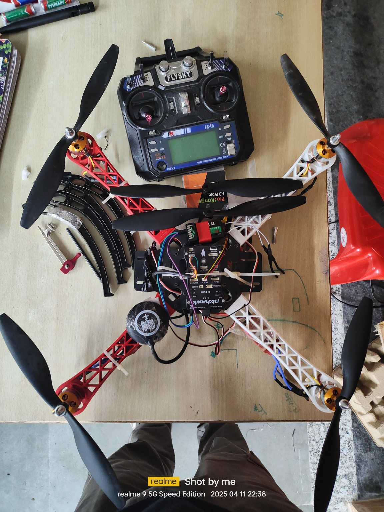

# 🛸 Quadcopter Drone Project!

## Overview

This is a custom buildt quadcopter drone for the agricultural autonomus navigation and surrvillience purposes. It is controlled using an RC transmitter and is equipped with a flight controller, GPS, and electronic speed controllers for stable and reliable flight.
This is a basic quadcopter built using the Pixhawk 2.4.8 flight controller. It’s designed as an entry-level drone project for hobbyists, students, and tinkerers to learn the fundamentals of flight control, calibration, and autonomous capabilities.
It combines open-source tools and modular components to create a stable and customizable flying platform for both manual and assisted flight.

---

## 🧩 Components

### 1. **Frame**

* **Type**: X-Frame (Plastic composite, modular)
* **Description**: A standard X-type quadcopter frame with four arms (two red, two white) and a central hub to mount the flight controller, battery, and other electronics.
* **Purpose**: Provides structure and support for all mounted components.
* **links** : ["Plastic Fiberglass X-Structure 4-Axis Frame for Drones"](https://www.amazon.com/Plastic-Fiberglass-X-Structure-4-Axis-Drones/dp/B07X55XGBN)  

### 2. **Propellers**

* **Type**: 1045 (10-inch, black plastic)
* **Quantity**: 4
* **Purpose**: Generates lift by rotating at high speed. Propeller direction must be matched to motor direction.
* **links** : ["10x4.5 inch 1045/1045R Propeller Pair (CW/CCW)"](https://vayuyaan.com/shop/quadcopter/10x4-5-inch-1045-1045r-propeller-pair-cwccw/) 

### 3. **Brushless Motors**

* **Model**: 2212 22000KV 
* **Quantity**: 4
* **Description**: Outrunner brushless DC motors, mounted at the ends of the arms.
* **Purpose**: Converts electrical power into mechanical rotation for the propellers.
* **links** : ["BGNing 2212 22000KV Brushless Outrunner Motor"](https://www.amazon.com/BGNing-Brushless-Outrunner-Controller-Quadcopter/dp/B00PXVWFQS)

### 4. **Electronic Speed Controllers (ESCs)**

* **Type**: 30A 
* **Quantity**: 4 (mounted beneath or on the arms)
* **Purpose**: Regulates the power supplied to each motor based on flight controller input.
* **links** : ["30A Brushless ESC with 3.5mm Connectors for Fixed-Wing Aircraft/Helicopter"](https://www.amazon.com/Brushless-3-5mm-Fixed-Wing-Aircraft-Helicopter/dp/B0D39DTNTQ/ref=sr_1_5?dib=eyJ2IjoiMSJ9.2WeV7nj2VdEsMkvO_Uxy9wMEIUHHY-xn6j9_BX6B0rbXU_fTsbxmwg1an8SWbPmgBEVAyjDwUSnzC0ImpcC6Mo-VLA-VHD1NYnLL5IR0aJrRGQ2wHvnNWGy2M4ZzZDWb8S2ndo6mCRjzAHQkrfrQeihnOVcOXggLXSPwxb_oxLusN6YF5jSgqVU8G7KgoY2SIg4Dy7HsKgSU9_FCgWUCiEnuX-py_ELeX-BTHDHn80Ll_frxwn013l9uc-J7hKHYFugcbxDTijmcLcgAq_GByCnxyyl8-60E90KHk4rnpNw.8uuxuwXUd2jUv7hJ8KroNADxIZ_A5TzXh5CL9uKGOD8&dib_tag=se&keywords=30a%2Besc&qid=1749008838&sr=8-5&th=1)

### 5. **Flight Controller**

* **Model**: Pixhawk 2.4.8
* **Description**: Central control unit that manages flight dynamics using sensor data (accelerometer, gyroscope, magnetometer, barometer).
* **Features**:Features:32-bit STM32F4 processor

    Supports autonomous flight with Mission Planner / QGroundControl

    GPS integration via dedicated port

    Multiple PWM outputs for ESCs, servos, and gimbals

    Failsafe systems (loss of signal, low battery, etc.)

* **links** : [Pixhawk 2.4.8](https://evelta.com/pixhawk-2-4-8-combo-set-main-board-sd-card-buzzer-safety-switch/?utm_campaign=%7BCampaignName%7D&utm_source=google&utm_medium=cpc&utm_matchtype=&utm_term=&adgroupid=&gc_id=21398421111&h_ad_id=&gad_source=1&gad_campaignid=21398421591&gbraid=0AAAAADwtsXn59Jf9OqoooMQm_9XPIUFic&gclid=Cj0KCQjwuvrBBhDcARIsAKRrkje-21VtRSpW9oNdiYTdUfXXVMCxGAT5fRhKYY2oZGIYd3VGRTpAIq8aAkBYEALw_wcB "")

### 6. **GPS Module integrated compass module**

* **Model**: Ublox Neo-M8N
* **Purpose**: Provides positional data for autonomous flight and failsafe return-to-home (RTH) features.
* **links** : [GPS Module integrated compass module](https://www.amazon.in/Robocraze-NEO-Module-Compass-ARDUPILOT/dp/B0DNTJDJHT?source=ps-sl-shoppingads-lpcontext&ref_=fplfs&psc=1&smid=AJ6SIZC8YQDZX)

### 7. **Power Distribution Board (PDB)**

* **Description**: Distributes power from the LiPo battery to the ESCs and flight controller.

### 8. **Battery**

* **Type**: LiPo 3S or 4S
* **Purpose**: Supplies power to the entire system.
* **links** : ["Plastic Fiberglass X-Structure 4-Axis Frame for Drones"](https://www.amazon.com/Pixhawk-BEC-Helicopter-Quadcopters-Accessories/dp/B0BCJM3R5P/ref=sr_1_4?crid=1PNEMUX95N6V8&dib=eyJ2IjoiMSJ9.8b0lfTseM_e0MHVdKplKjy2248VJd57B_RlylyvN0YkzjRqiz6UNgpeIY0FRFFcQHVC-O1ko4mfRYpUx60r63PTkF7vQE9mu59b9OXgk9J84hWQyy6D1vjLKlcqdYLQOpvjvYnHHi4cZhDOVa5bndxmSU7z_JRPv5ftaKahRaGLXBUrf1fJKJOreEXL9RyfNibaDx-H_Etluz80dorLmJI5mpKuMb18lOBIqxPd1tS8.EXzWs6oiKllyDoPtzoi-x33mOSQvFepsiwEEaykTDB4&dib_tag=se&keywords=power%2Bmodule&qid=1749009174&sprefix=power%2Bmodule%2Caps%2C494&sr=8-4&th=1)

### 9. **RC Transmitter and Receiver**

* **Transmitter**: FlySky FS-i6
* **Receiver**: FS-iA6B 
* **Channels**: 6-channel
* **Purpose**: Manual control of the drone via 2.4GHz frequency.
* **links** : ["Fly Sky FS-CT6B 6CH 2.4GHz Transmitter & Receiver"](https://robocraze.com/products/fly-sky-fs-ct6b-6ch-2-4ghz-transmitter-receiver?variant=40192665911449&country=IN&currency=INR&utm_medium=product_sync&utm_source=google&utm_content=sag_organic&utm_campaign=sag_organic&campaignid=21593322920&adgroupid=&keyword=&device=c&gad_source=1&gad_campaignid=21586700133&gbraid=0AAAAADgHQvbcF0LdNPXauUodo94YW_xyc&gclid=Cj0KCQjwuvrBBhDcARIsAKRrkjcr-BqHGGH8sfuL5ziQrJMXFjMqFGZrYZuaXQLX5FnFkweMNcOAUioaAvuOEALw_wcB)

### 10. **Telemetry Module (optional)**

* **Purpose**: Sends flight data to ground control software like Mission Planner (not clearly visible but often paired with Pixhawk).

### 11. **Buzzer**

* **Purpose**: Audible alerts for low battery, lost model, arming status.
* **links** : [Electronic Continuous Buzzer for Computers and Automotive Equipment](https://www.amazon.com/Electronic-Continuous-Computers-Automotive-Equipment/dp/B08KW6HB1P/ref=sxin_16_pa_sp_search_thematic_sspa?content-id=amzn1.sym.6b4b6d33-3832-496c-bacc-442447e09e47%3Aamzn1.sym.6b4b6d33-3832-496c-bacc-442447e09e47&crid=1XW126JX486E8&cv_ct_cx=buzzer+module+pixhawk+3&keywords=buzzer+module+pixhawk+3&pd_rd_i=B08KW6HB1P&pd_rd_r=1b9f434e-870c-4f21-a70a-ac49e64f7341&pd_rd_w=wQJVE&pd_rd_wg=q8dYr&pf_rd_p=6b4b6d33-3832-496c-bacc-442447e09e47&pf_rd_r=NSWCBY4R6HGBK737MNZP&qid=1749009513&sbo=RZvfv%2F%2FHxDF%2BO5021pAnSA%3D%3D&sprefix=buzzer+module+pixhawk%2Caps%2C820&sr=1-2-6024b2a3-78e4-4fed-8fed-e1613be3bcce-spons&sp_csd=d2lkZ2V0TmFtZT1zcF9zZWFyY2hfdGhlbWF0aWM&psc=1)
### 12. **Mounting & Wiring**

* Zip ties and Velcro are used for clean cable management and vibration isolation.

---

##  Assembly Notes

* Ensure motors are wired correctly for clockwise (CW) and counterclockwise (CCW) rotations.
* Calibrate ESCs using flight controller tools.
* Secure all connectors and isolate exposed wires to avoid shorts.

---

##  Ground Control Software

* **Mission Planner** (Windows)
* **QGroundControl** (Cross-platform)
* Use this software to:

  * Calibrate sensors
  * Plan missions
  * Monitor live telemetry

---

##  Pre-Flight Checklist

*  Check motor rotation and prop direction
*  Calibrate compass and accelerometer
*  Arm the drone safely
*  Ensure GPS lock (if needed for mode)
*  Battery fully charged

---

##  Safety Tips

* Fly in open areas, away from people.
* Keep a safe distance during motor tests.
* Always disarm the drone before touching it.

---

Let me know if you want me to generate a PDF or DOCX version, or include wiring diagrams or ESC calibration steps.
